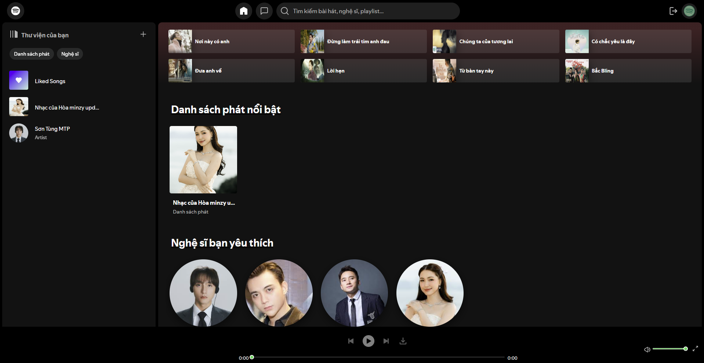
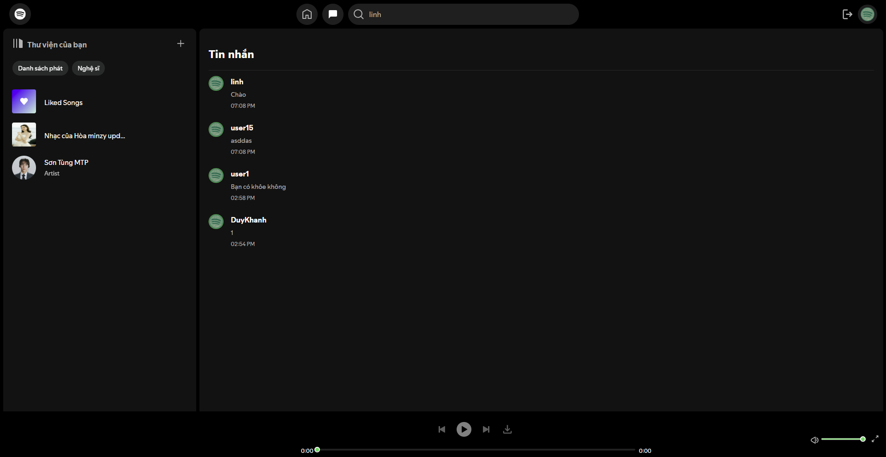
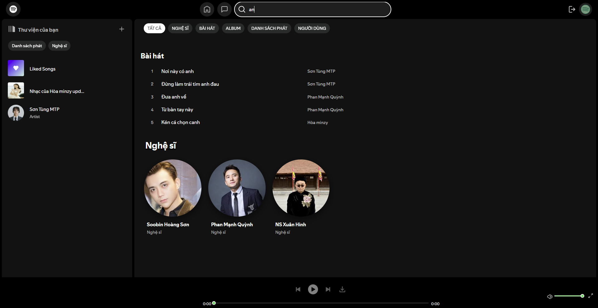
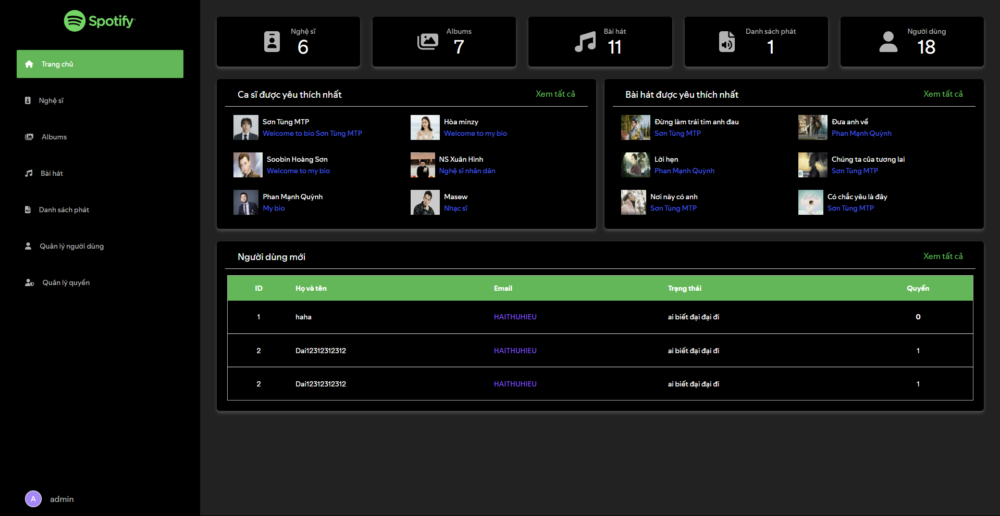
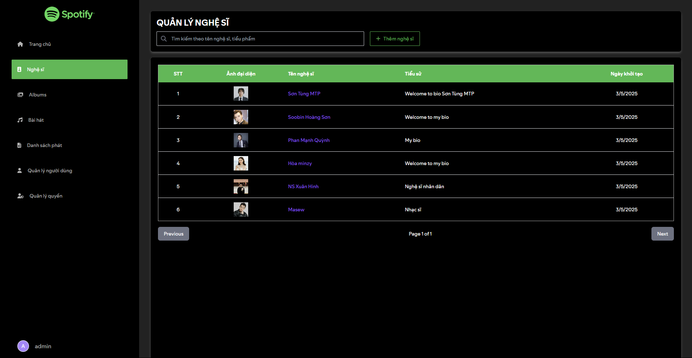
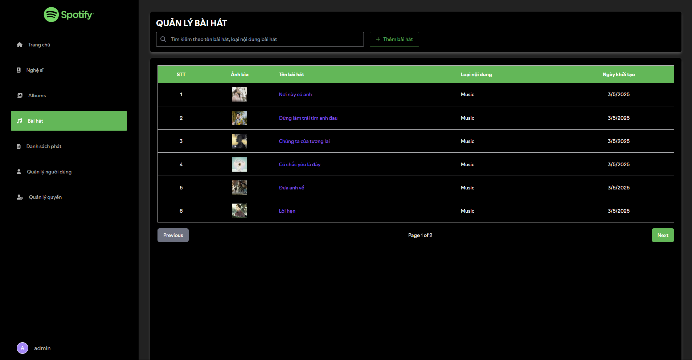

# Spotify Clone – Frontend
Đây là phần **Frontend** của dự án Spotify Clone, được xây dựng bằng **React** và **Vite**.
> 💡 Lưu ý: Repository này chỉ chứa phần frontend.
> 
> 🔗 Phần Backend của dự án có thể được tìm thấy tại: [Spotify_Clone_BE](https://github.com/tranlinh102/Spotify_Clone_BE)

> 🔄 Dự án này được lấy nguồn và tùy chỉnh từ [spotify-react-web-client](https://github.com/francoborrelli/spotify-react-web-client) của francoborrelli.

---

## 🚀 Công nghệ sử dụng
- ⚛️ **React 19**, **React Router DOM** – Xây dựng giao diện và điều hướng SPA
- ⚡ **Vite** – Công cụ build nhanh, hiện đại
- 🎨 **Ant Design**, **Material UI**, **Tailwind CSS**, **@ant-design/pro-form** – Thư viện UI
- 💅 **Emotion**, **SASS (sass-embedded)**, **PostCSS**, **Autoprefixer** – Styling
- 🧠 **Redux Toolkit**, **React Redux**, **Redux Persist** – Quản lý state toàn cục
- 🔁 **Axios**, **use-debounce** – Giao tiếp API và xử lý debounce
- 🕒 **React Time Ago**, **javascript-time-ago** – Hiển thị thời gian tự nhiên
- 🎨 **FontAwesome**, **React Icons**, **ColorThief**, **TinyColor2** – Icon và xử lý màu
- ⚙️ **React Drag ListView**, **React Resizable Panels**, **React Full Screen** – Tương tác UI nâng cao
- ✅ **ESLint**, **eslint-plugin-react-hooks**, **eslint-plugin-react-refresh** – Kiểm tra chất lượng mã
- 🔑 **@react-oauth/google** – Hỗ trợ tích hợp đăng nhập OAuth với Google

---

## ✨ Tính năng
### Tính năng người dùng
- 🎵 **Quản lý playlist** - Tạo, chỉnh sửa và xóa playlist cá nhân
- 🎧 **Phát nhạc, video** - Nghe nhạc với các chức năng phát, tạm dừng, xem video
- 👥 **Theo dõi nghệ sĩ** - Theo dõi hoặc hủy theo dõi nghệ sĩ yêu thích
- 💬 **Nhắn tin** - Trò chuyện với bạn bè và người dùng khác
- 🔍 **Tìm kiếm** - Tìm kiếm bài hát, album, nghệ sĩ và playlist
- ⬇️ **Tải nhạc** - Tải bài hát yêu thích về thiết bị
- 📹 **Tải video** - Xem và tải video âm nhạc

### Tính năng Admin
- 👮 **Quản lý người dùng** - Xem và quản lý tài khoản người dùng
- 🎼 **Quản lý nội dung** - Thêm, sửa, xóa bài hát, album và nghệ sĩ
- 📊 **Thống kê** - Xem báo cáo và số liệu thống kê

---

## 📦 Hướng dẫn cài đặt
1. **Clone repository**
   ```bash
   git clone https://github.com/MinhTriTech/spotify-clone-fe.git
   cd spotify-clone-fe
   ```
2. **Cài đặt thư viện**
   ```bash
   npm install
   ```
3. **Chạy server phát triển**
   ```bash
   npm run dev
   ```
   
---

## 👥 Thành viên dự án
- **Ngô Hoàng Minh Trí** - Phát triển giao diện User
- **Nguyễn Quốc Đại** - Phát triển giao diện Admin

---

## 📸 Screenshots
Dưới đây là một số hình ảnh của ứng dụng. Xem thêm trong [thư mục images](https://github.com/MinhTriTech/spotify-clone-fe/tree/main/images).

<div align="center">
  
  
  
</div>
<div align="center">
  
  
  
</div>

---

## Liên hệ
- Nếu bạn có bất kỳ câu hỏi hoặc góp ý nào, vui lòng liên hệ qua email: **hoangminhtri.ngo@gmail.com**.
---
Cảm ơn bạn đã sử dụng ứng dụng này! 🚀
